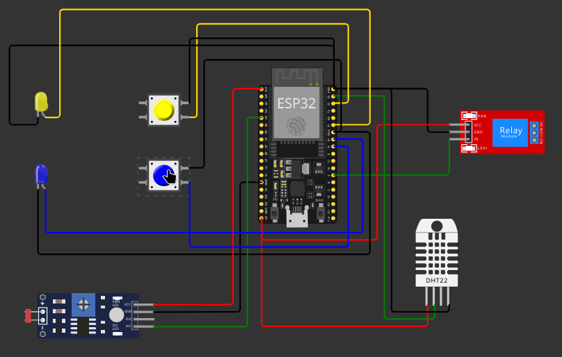

# FIAP - Faculdade de Informática e Administração Paulista

<p align="center">
<a href= "https://www.fiap.com.br/"></a>
</p>

<br>

# SoilControl

## Grupo 89

## 👨‍🎓ntegrantes: 
- <a href="https://www.linkedin.com/in/liquuid">Fernando Henrique Rodrigues da Silva</a>


## 👩‍🏫rofessores:

### Tutor(a) 
- <a href="https://www.linkedin.com/in/lucas-gomes-moreira-15a8452a/">Lucas Gomes Moreira</a>
### Coordenador(a)
- <a href="https://www.linkedin.com/in/profandregodoi/">André Godoi</a>


# Fase 3 - Cap 10


#Sistema de Irrigação Automatizada e Inteligente
## Introdução

Visando aprimorar a eficiência hídrica e nutricional das culturas agrícolas, desenvolvemos um sistema de irrigação automatizado que monitora em tempo real a umidade do solo, os níveis de nutrientes essenciais (fósforo - P e potássio - K) e o pH. Através da integração de sensores precisos e atuadores eficientes, o sistema ajusta automaticamente a quantidade de água e nutrientes aplicados, garantindo o desenvolvimento saudável das plantas e a otimização dos recursos naturais. É importante notar que os comportamentos dos sensores e os valores de entrada são simulados na plataforma Wokwi e inseridos manualmente no sistema para análise e atuação.

## Software do IOT

O software do IOT é um programa desenvolvido para um microcontrolador (como um Arduino ou ESP32) que automatiza o monitoramento e controle das condições ideais para o cultivo de banana. Ele realiza as seguintes funções:

    Monitoramento dos Níveis de Nutrientes:
        Fósforo (P) e Potássio (K): Utiliza botões para simular sensores que detectam os níveis desses nutrientes no solo. Quando o botão correspondente está pressionado, o sistema interpreta que o nível do nutriente está normal; caso contrário, está insuficiente. LEDs são usados para indicar visualmente o status de cada nutriente.

    Medição do pH do Solo:
        Sensor LDR: Embora um LDR seja tipicamente usado para medir a intensidade da luz, neste contexto ele é empregado para estimar o pH do solo. O valor analógico lido pelo LDR é mapeado para uma escala de pH de 0 a 14, permitindo ao sistema determinar se o pH está dentro do nível ideal para o cultivo de banana.

    Monitoramento da Umidade e Temperatura:
        Sensor DHT22: Mede a umidade relativa do ar e a temperatura ambiente. Esses dados são essenciais para avaliar se as condições ambientais são propícias para o crescimento saudável das plantas.

    Controle da Irrigação:
        Bomba de Irrigação via Relé: Com base nas leituras dos sensores de nutrientes, pH e umidade, o sistema decide o tempo de ativação da bomba de irrigação.
            Condições Não Ideais: Se qualquer um dos parâmetros (nível de nutrientes, pH ou umidade) estiver abaixo do ideal, o sistema aumenta o tempo de irrigação para 3 segundos, visando compensar a deficiência.
            Condições Ideais: Se todos os parâmetros estiverem dentro dos níveis ideais, o sistema mantém um tempo de irrigação moderado de 2 segundos.

    Feedback ao Usuário:
        O sistema imprime no monitor serial mensagens informando o status de cada parâmetro, permitindo ao usuário acompanhar em tempo real as condições do cultivo.

## Base de Dados

A base de dados do sistema é composta por quatro tabelas principais. A tabela culturas contém informações detalhadas sobre as culturas, incluindo nome, exigências nutricionais específicas, níveis ideais de umidade e pH. A tabela sensores armazena especificações dos sensores utilizados, como tipo (umidade, nutrientes, pH), descrição e localização no campo. As medições realizadas pelos sensores são registradas na tabela leituras, em intervalos definidos para cada cultura específica. Por fim, a tabela irrigacoes documenta as ações de irrigação executadas, incluindo duração, motivo e data.
Funcionamento

O sistema opera em quatro etapas principais. Na fase de coleta de dados, sensores especializados medem a umidade do solo, detectam a concentração de nutrientes como fósforo e potássio e determinam o pH do solo, fatores que influenciam diretamente a disponibilidade de nutrientes para as plantas. Os dados coletados são armazenados na tabela leituras para posterior análise.

Durante a análise dos dados, o sistema compara as leituras atuais com os parâmetros ideais estabelecidos para cada cultura. Se a umidade estiver abaixo do ideal ou se forem detectadas deficiências nutricionais, aplica-se a regra de irrigação e fertirrigação. Nesse caso, o sistema aciona a bomba d'água e, se necessário, os dosadores de nutrientes, garantindo que as plantas recebam a quantidade adequada de água e nutrientes.

Na etapa de atuação, a bomba d'água e os dosadores de nutrientes são ativados conforme a necessidade identificada, ajustando precisamente a quantidade de recursos fornecidos ao solo. Isso assegura que as plantas tenham condições ideais para um crescimento saudável e produtivo.

Finalmente, no registro, cada nova leitura que exige intervenção gera automaticamente um registro na tabela irrigacoes. Esse procedimento cria um histórico detalhado das ações realizadas, facilitando o monitoramento e o planejamento das práticas agrícolas futuras.

## Operações CRUD

O sistema oferece diversas operações para gerenciamento eficiente dos dados. No que se refere aos sensores, é possível cadastrar novos dispositivos instalados no campo, exibir todos os sensores ativos, modificar informações ou calibrar sensores existentes e remover aqueles que não estão mais em uso.

Em relação às culturas, o sistema permite a inserção de novas culturas com suas exigências específicas, a exibição de todas as culturas cadastradas com seus parâmetros ideais, a atualização de informações de culturas existentes e a remoção de culturas que não são mais cultivadas.

Para as irrigações, o sistema gera automaticamente um registro sempre que uma leitura indicar necessidade de intervenção. Além disso, é possível consultar o histórico de irrigações realizadas e excluir registros para fins de manutenção e limpeza de dados.
Imagens do Circuito na Plataforma Wokwi.com

A seguir, apresentamos o diagrama esquemático das conexões dos sensores no simulador Wokwi, ilustrando a configuração do sistema:

## Diagrama Wokwi

 

 ## 📁 Estrutura de pastas

- <b>config</b>: Configurações.
- <b>src</b>: Aqui fica o código fonte do projeto. 


## 🔧 Como executar o código

```
python -m venv venv
source venv/bin/activate
pip install -r requirements.txt
# altere o json em config/config.json
python src/python/crud.py # para receber a lista de comandos
```
## video

https://youtu.be/vpOCbDXBUhI

## 🗃 Histórico de lançamentos

* 0.1.0 - 16/11/2024
    

## 📋 Licença

<p xmlns:cc="http://creativecommons.org/ns#" xmlns:dct="http://purl.org/dc/terms/"><a property="dct:title" rel="cc:attributionURL" href="https://github.com/agodoi/template">MODELO GIT FIAP</a> por <a rel="cc:attributionURL dct:creator" property="cc:attributionName" href="https://fiap.com.br">Fiap</a> está licenciado sobre <a href="http://creativecommons.org/licenses/by/4.0/?ref=chooser-v1" target="_blank" rel="license noopener noreferrer" style="display:inline-block;">Attribution 4.0 International</a>.</p>